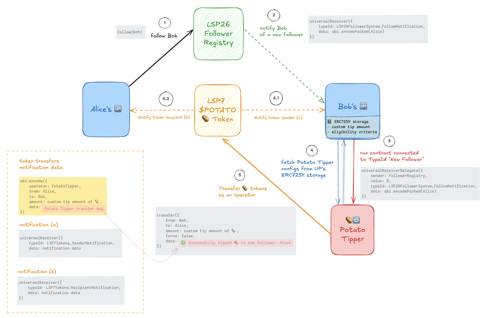

# 🥔🔁 POTATO Tipper **contracts** - [](https://github.com/CJ42/potato-tipper-contract/actions/workflows/test.yml) [](./README.md#code-coverage)

Smart contracts of the POTATO Tipper, a contract that enables you to tip on follow, acting as an incentive mechanism to gain new followers.

| Network       | Contract address                                                |
| :------------ | :-------------------------------------------------------------- |
| LUKSO Mainnet | 🔜                                                              |
| LUKSO Testnet | (code will change) `0xf2b2ac53d3A3EeaF2a2a10084b0EC88F2424f066` |

```
⣿⣿⣿⣿⣿⣿⣿⣿⣿⣿⣿⣿⣿⣿⣿⣿⣿⣿⣿⣿⣿⣿⣿⣿⣿⣿⡿⠿⢛⠫⡍⢭⡙⢦⢋⠭⠩⢟⠻⠿⣿⣿⣿⣿⣿⣿⣿⣿⣿⣿⣿⣿
⣿⣿⣿⣿⣿⣿⣿⣿⣿⣿⣿⣿⣿⣿⣿⣿⣿⣿⣿⣿⣿⣿⣿⠟⢋⢡⢆⡹⠢⠛⠜⢦⡙⠦⢋⢞⡙⢦⠎⣅⠒⠩⣛⢿⣿⣿⣿⣿⣿⣿⣿⣿
⣿⣿⣿⣿⣿⣿⣿⣿⣿⣿⣿⣿⣿⣿⣿⣿⣿⣿⣿⣿⡿⠋⣄⠞⡌⣊⣤⣶⣿⣿⣿⢿⡿⣿⢷⣦⡝⢢⢛⡬⣙⢣⣄⠣⢝⠻⣿⣿⣿⣿⣿⣿
⣿⣿⣿⣿⣿⣿⣿⣿⣿⣿⣿⣿⣿⣿⣿⣿⣿⣿⡿⢋⠤⣓⠜⣴⣾⡿⣟⣯⣷⢿⡾⣿⣽⣟⣯⣿⣻⢀⠯⢠⣶⣶⣌⠳⣌⠣⡝⢿⣿⣿⣿⣿
⣿⣿⣿⣿⣿⣿⣿⣿⣿⣿⣿⣿⣿⣿⣿⣿⣿⡟⢡⢇⠛⣠⣿⣿⣳⡿⣿⣽⣯⣿⣻⣷⣻⡾⠻⢓⡡⢎⠞⡤⠛⠯⠿⠃⣌⢳⡘⢎⢻⣿⣿⣿
⣿⣿⣿⣿⣿⣿⣿⣿⣿⣿⣿⣿⣿⣿⣿⣿⡟⢌⡲⢉⣾⣿⣻⣞⡿⠝⣓⢋⡬⢡⡍⣔⢢⡒⣝⢢⡝⢬⣋⠼⡹⢜⢲⡙⣬⢃⡞⣌⠇⢻⣿⣿
⣿⣿⣿⣿⣿⣿⣿⣿⣿⣿⣿⣿⣿⣿⣿⡿⣈⠖⣡⣿⣟⡾⢋⢅⡲⢍⠮⣱⢊⢗⡸⡌⣇⠞⣬⠲⡈⠑⡬⢣⠝⡊⢕⠚⣤⠫⢴⠈⢸⠈⣿⣿
⣿⣿⣿⣿⣿⣿⣿⣿⣿⣿⣿⣿⣿⣿⡿⡁⣜⢰⢿⣻⠞⢰⡩⢖⡩⢎⡣⡕⣎⠎⡵⣘⠦⢫⡔⢫⡔⢎⡱⣋⠼⣁⠂⠉⠴⡙⢆⡀⢤⠘⢸⣿
⣿⣿⣿⣿⣿⣿⣿⣿⣿⣿⣿⣿⣿⡿⡑⣜⠢⣌⢋⢥⡘⠧⡜⣣⡙⢦⢓⡱⣊⠽⡰⣍⠺⣅⠞⡱⡜⢣⠵⣉⢮⠱⡆⡅⠄⠑⢢⡙⢦⠈⠄⣿
⣿⣿⣿⣿⣿⣿⣿⣿⣿⣿⣿⡿⢏⡰⣱⠪⡕⠎⡜⢦⡹⣑⢣⡕⢎⡣⡝⠢⡝⢲⡱⢪⢕⡪⢍⡳⢜⡣⡝⡸⢆⡛⡜⣬⠱⠤⣀⡙⡆⠈⢆⢻
⣿⣿⣿⣿⣿⣿⣿⣿⣿⠿⢋⡔⢦⠓⣥⠳⣙⢆⡠⠄⢀⡉⠲⡜⢣⡕⢎⡰⢜⢣⡱⢋⢦⡙⣎⡱⢎⢖⡩⡕⢮⠱⣍⠲⣍⢳⡡⡝⠄⡡⢊⢸
⣿⣿⣿⣿⣿⣿⣿⠟⢁⡜⡲⢜⢣⣋⢦⡹⢌⡞⣰⢋⡖⠴⣣⠹⢥⡚⡥⢋⢮⡑⢮⡙⢦⡹⣐⠧⣍⠺⣔⡹⣌⠳⣌⠇⠈⠰⡱⢎⠐⢄⠣⢸
⣿⣿⣿⣿⣿⠟⠁⡠⢋⠴⣙⢎⡱⡜⣢⢇⢫⡔⡣⢇⡺⢱⣡⠛⣆⠧⣙⠭⣒⢭⠲⣙⠦⣱⠣⠞⣌⠳⣌⠶⣌⠳⣌⠖⡤⣄⢳⠁⢌⠢⡘⢸
⣿⣿⣿⣿⢋⡠⢆⠄⣀⢱⡩⢎⢖⡱⠥⡎⠑⣸⠱⣩⠖⣣⠎⡵⣊⢞⡡⢏⡜⢦⠛⡴⡙⢦⡹⢩⢎⠵⣊⠶⣉⠞⣬⢚⡱⡌⡇⠈⡔⢂⠅⣺
⣿⣿⡿⡑⢦⠹⡜⣊⢖⡣⣜⠣⠞⣌⠳⣜⠲⢥⢛⡤⢛⡤⡛⢴⢃⢮⠱⣎⡜⢎⡹⡒⣝⢢⣍⡓⢎⡣⢇⡳⣉⠞⡴⡩⢖⡱⢀⠱⡈⢆⠂⣿
⣿⣿⠃⡲⣩⠎⡵⢩⢲⠱⣌⢏⡹⣌⠳⡬⣙⠎⣖⡩⢞⡰⣙⠎⡞⣌⢳⢒⡜⡣⢵⢩⣒⢣⠦⣙⢎⡱⢣⠵⣉⢞⣡⠳⣩⠀⠢⠑⡌⡐⢲⣿
⣿⡇⠄⡣⡕⢮⢱⢋⡬⢳⡸⢬⡱⣌⠳⢥⢣⣋⠦⡓⢥⡓⣍⠺⡱⣌⡓⠮⣜⠱⣣⢣⢚⢦⡹⠘⢬⢃⠯⡜⣱⢊⡖⡹⠀⢄⠃⠱⠠⠡⣼⣿
⣿⠠⠀⢧⠹⡜⢪⡱⢎⡕⢮⡑⣖⢩⠞⣡⠳⣌⢣⠉⠂⠙⠬⡓⡵⢢⡝⣱⢊⢧⡱⢎⢣⠖⡱⡄⣎⢭⢲⡙⡴⢋⡴⠃⠨⠄⠀⠀⢡⢃⣿⣿
⡇⠂⡁⢎⢳⣉⢧⡱⢎⡜⢦⡹⢰⣋⠼⣡⠳⣌⠧⢳⡌⣂⠄⡁⠑⡣⢞⡰⢋⢦⠓⣎⢣⢫⢕⡚⡴⢪⡑⢮⣑⠫⢀⠌⡱⢈⠆⡉⠆⣼⣿⣿
⡇⠡⡘⠈⡶⢡⢖⡑⠊⢜⡱⡜⢣⣌⢳⣡⠳⡜⣪⠵⡸⣑⠮⡔⢦⡙⢦⡹⢩⢲⠹⣌⢣⢇⠮⡱⢎⡵⡙⢦⠃⡡⢌⠢⡁⢎⠰⢡⢰⣿⣿⣿
⣇⠁⠰⣁⠘⠧⣎⡔⢦⠚⡴⡩⠧⡜⣒⠦⡛⢴⢃⡞⡱⣌⠳⡜⢣⡙⢦⢍⣇⢫⡜⢬⠣⠎⠓⣭⢒⠖⡹⠂⡌⡐⢢⠑⡌⢢⠑⢢⣿⣿⣿⣿
⣿⠈⡔⢠⢂⠹⡰⣚⠬⡛⡴⢩⢇⢳⣉⠶⡙⣎⠎⢶⡑⡎⢧⢹⣡⠛⣬⠲⡜⣢⠝⣪⢅⡂⣄⠲⡍⠎⣁⠒⠤⡑⠢⡑⢌⢂⢡⣿⣿⣿⣿⣿
⣿⡇⠄⠣⢌⠢⢄⠫⡜⣱⠩⣇⠎⡧⢜⡪⢕⣪⡙⢦⡹⢸⡡⢇⠶⡙⣆⢳⡱⡱⢎⡱⢎⡱⢎⢃⢁⠒⠤⡉⢆⠡⢃⠜⡠⢢⣿⣿⣿⣿⣿⣿
⣿⣿⡈⠔⣈⠒⡌⠰⡈⡁⠷⢬⣙⠲⢭⣘⢣⠦⣙⢦⡙⠀⢙⡎⡵⡙⡴⢃⠶⣙⢬⠓⠎⡁⢆⠰⡈⠜⡠⠑⡌⢢⠁⠎⣰⣿⣿⣿⣿⣿⣿⣿
⣿⣿⣷⡐⠠⢃⠌⡱⢠⠑⡐⢂⠌⡙⠦⢣⢣⢝⡢⢧⡙⢦⢋⡴⢣⠝⡲⡍⠞⣁⠊⡔⢡⠘⡄⢃⠀⠀⢁⠣⡘⢄⠉⣴⣿⣿⣿⣿⣿⣿⣿⣿
⣿⣿⣿⣷⡀⡁⢊⠤⣁⠊⠀⠁⠒⡐⢢⠁⠆⡌⢠⠡⡙⢌⠣⢌⠡⡉⠔⡠⢃⠄⠃⠌⡄⠃⠜⣀⠂⠤⡈⢆⠑⣠⣾⣿⣿⣿⣿⣿⣿⣿⣿⣿
⣿⣿⣿⣿⣿⣄⠂⠐⠠⠀⠀⢀⠰⡁⢆⡉⠒⡌⢢⠑⡌⢢⠘⡄⢣⠘⠤⡑⠌⡌⡁⠄⡠⠁⠂⠤⢉⠆⡑⣀⣴⣿⣿⣿⣿⣿⣿⣿⣿⣿⣿⣿
⣿⣿⣿⣿⣿⣿⣷⣄⠀⠈⠆⡡⢂⡑⠢⢌⠱⡈⢆⠱⡈⢆⠱⡈⠀⠘⠠⡑⠌⠤⢁⠢⢄⠡⠂⡀⢂⣠⣾⣿⣿⣿⣿⣿⣿⣿⣿⣿⣿⣿⣿⣿
⣿⣿⣿⣿⣿⣿⣿⣿⣷⣌⡄⢀⠃⢌⠱⡈⢆⠱⡈⢆⠱⡈⢆⠁⠀⠀⡀⠔⠀⠀⢣⠘⡠⢁⣣⣴⣿⣿⣿⣿⣿⣿⣿⣿⣿⣿⣿⣿⣿⣿⣿⣿
⣿⣿⣿⣿⣿⣿⣿⣿⣿⣿⣿⣶⣬⣀⠆⢡⢊⡐⢡⠊⠔⠡⠊⠌⢡⠃⡜⢈⠄⢃⣂⣥⣶⣿⣿⣿⣿⣿⣿⣿⣿⣿⣿⣿⣿⣿⣿⣿⣿⣿⣿⣿
⣿⣿⣿⣿⣿⣿⣿⣿⣿⣿⣿⣿⣿⣿⣿⣷⣶⣮⣤⣭⣤⣥⣬⣬⣤⣵⣶⣶⣿⣾⣿⣿⣿⣿⣿⣿⣿⣿⣿⣿⣿⣿⣿⣿⣿⣿⣿⣿⣿⣿⣿⣿⠀
```

> **⚠️ Disclaimer:** the `PotatoTipper.sol` contract is experimental. Use it responsibly and at your own risk.
>
> Although it has been thoroughly tested with Foundry and some auditing tools, it has not been formally audited by an external third party auditor.
>
> See the [**Security Notes & Limitations**](#security-notes--limitations) section for more details on the auditing tools used and the known trade-offs.

- [🥔🔁 POTATO Tipper **contracts** - ](#-potato-tipper-contracts----)
  - [Overview](#overview)
  - [Known Limitations](#known-limitations)
  - [Technical Details](#technical-details)
    - [Smart contract specifics](#smart-contract-specifics)
    - [Interaction Flow](#interaction-flow)
  - [Learning](#learning)
  - [Security](#security)
  - [Code Coverage](#code-coverage)
  - [Gas report](#gas-report)
- [Development](#development)
  - [Pre-requisites](#pre-requisites)
  - [Developing with Foundry](#developing-with-foundry)

## Overview

- 🫡 **Permission-less**: smart contract not controlled or governed by anyone
- 🔄 **Automatic tipping mechanism:** built fully on-chain for 🆙 when receiving new followers
- 🚫 **Censorship resistant:** tipping happens automatically in the background on-chain, regardless of the dApp you are using to follow the user (not tied to a specific dApp, no _"dApp lock-in"_)
- ⚙️ **Configurable settings:**

  - customizable tip amount (🥔, or 🥔🥔, or 🥔🥔🥔, or more...)
  - allocated tipping budget (cannot use user's full 🥔 balance unless configured as such)
  - eligibility criteria for a new follower to get a tip (_e.g: at least have 3 followers, or X amount of $POTATO tokens_)

- 🌐 **Portable settings:** PotatoTipper’s settings live as metadata inside each user’s 🆙, making them:

  - easily readable (per user, instead of having to interact with the `PotatoTipper` contract)
  - easily portable (_e.g: if a future Potato Tipper v2 is live, the settings are portable and don’t need to be reset again_)

- ✅🆙 **Only for Universal Profile:** only 🆙 can receive tips (❌🔑 not EOAs)
  - new followers can only get one tip per user. They cannot unfollow and re-follow to try to get many tips.
  - existing followers are not eligible to receive tips from 🆙 users they already follow

## Known Limitations

- The Potato Tipper only works for new followers (therefore the notion of an _"incentive system"_). Existing followers cannot get tipped (as mentioned above). If a user (Alice) connects the Potato Tipper to its UP, and Bob was following Alice before she used the Potato Tipper, Bob will never be able to get a tip from the Potato Tipper contract. Even by trying to unfollow and re-follow Alice.
- If Alice's UP follows Bob's UP and get tipped some 🥔, this does not guarantee that Alice will keep following Bob's afterwards. If Alice unfollows Bob, Bob will not get the 🥔 he tipped back. The Potato Tipper is not opinionated towards this behaviour as UPs might unfollow each other afterwards for legitimate reasons. The Potato Tipper cannot differentiate that.

## Technical Details

### Smart contract specifics

- 📢 Built as an LSP1 Universal Receiver Delegate contract.
- 🔌 Work automatically once it is _"plugged-in_ to a Universal Profile to reacts on follow / unfollow notifications from LSP26 Follower System. This can be done by setting the Potato Tipper contract address as a value under the following data keys in a UP:

  - `LSP1UniversalReceiverDelegate:LSP26FollowerSystem_FollowNotification` -> `0x0cfc51aec37c55a4d0b1000071e02f9f05bcd5816ec4f3134aa2e5a916669537`
  - `LSP1UniversalReceiverDelegate:LSP26FollowerSystem_UnfollowNotification` -> `0x0cfc51aec37c55a4d0b100009d3c0b4012b69658977b099bdaa51eff0f0460f4`

- 🤝🏻 Act as an operator via [`authorizeOperator(...)`](https://docs.lukso.tech/contracts/contracts/LSP7DigitalAsset/#authorizeoperator) to transfer tokens on behalf of the user's UP.
  - Give it the allocated tipping budget as authorized amount / allowance.
  - No 🥔 tokens need to be transferred to the `PotatoTipper` contract (it transfers them on behalf of the user's 🆙).

### Interaction Flow



## Learning

You can learn more about the Potato Tipper and its design patterns that use the [LSP1 Universal Receiver Delegate](https://docs.lukso.tech/standards/accounts/lsp1-universal-receiver-delegate/) standard through the [`LEARN.md`](./LEARN.md) file.

## Security

For security reports generated with AI auditing tools from Ackee and Nethermind, and additional security notes, see the [`audits/`](./audits/) folder.

## Code Coverage

```
╭----------------------+----------------+----------------+---------------+---------------╮
| File                 | % Lines        | % Statements   | % Branches    | % Funcs       |
+========================================================================================+
| src/PotatoTipper.sol | 95.45% (42/44) | 95.24% (40/42) | 85.71% (6/7)  | 100.00% (8/8) |
╰----------------------+----------------+----------------+---------------+---------------╯

Uncovered for src/PotatoTipper.sol:
- Line (location: source ID 102, lines 137..138, bytes 14351..14408, hits: 0)
- Statement (location: source ID 102, lines 137..138, bytes 14351..14408, hits: 0)
- Branch (branch: 13, path: 0) (location: source ID 102, lines 234..237, bytes 19179..19277, hits: 0)
- Line (location: source ID 102, lines 235..236, bytes 19197..19262, hits: 0)
- Statement (location: source ID 102, lines 235..236, bytes 19197..19262, hits: 0)
```

## Gas report

```log
$ forge snapshot --fork-url https://rpc.mainnet.lukso.network
[⠊] Compiling...
[⠑] Compiling 2 files with Solc 0.8.30
[⠘] Solc 0.8.30 finished in 1.65s
Compiler run successful!

Ran 29 tests for test/PotatoTipper.t.sol:PotatoTipperTest
[PASS] test_AliceUPCannotCallBobUPUniversalReceiverFunctionToGetTipped() (gas: 175240)
[SKIP] test_EOAsCannotFollowAndReceiveTips(uint160) (runs: 0, μ: 0, ~: 0)
[PASS] test_ExistingFollowerUnfollowsAndRefollowDoesNotTriggerTip() (gas: 321610)
[PASS] test_FallbackToDisplayGenericErrorMessageInUniversalReceiverEventIfTippingFails() (gas: 715078)
[PASS] test_FollowerDoesNotAlreadyFollowUser() (gas: 15202)
[PASS] test_FollowerFollowUser() (gas: 201163)
[PASS] test_IsLSP1Delegate() (gas: 8516)
[PASS] test_NewFollowerFailsToGetTipIsEligibleToUnfollowAndRefollowToGetTip() (gas: 492948)
[PASS] test_OnlyCallsFromFollowerRegistry(address) (runs: 1030, μ: 164865, ~: 164867)
[PASS] test_OnlyRunWithFollowOrUnfollowTypeId(bytes32) (runs: 1030, μ: 34793, ~: 34784)
[PASS] test_PotatoTipperIsRegisteredForNotificationTypeNewFollower() (gas: 17250)
[PASS] test_PotatoTipperIsRegisteredForNotificationTypeUnfollow() (gas: 17217)
[PASS] test_TippingFailsAfterTippingBudgetGoesBelowCustomAmount(uint256) (runs: 1030, μ: 644487, ~: 644502)
[PASS] test_TippingFailsAfterTippingBudgetGoesToZero() (gas: 561483)
[PASS] test_cannotTipTwiceTheSameNewFollowerIfFollowedUnfollowAndRefollow() (gas: 521577)
[PASS] test_customTipAmount() (gas: 457728)
[SKIP] test_customTipAmountGreaterThanUserBalanceButLessThanTippingBudgetDontTriggerTip(uint256,uint256) (runs: 0, μ: 0, ~: 0)
[PASS] test_customTipAmountIncorrectlySetDontTriggerTip(bytes) (runs: 1022, μ: 379331, ~: 378889)
[PASS] test_customTipAmountLessThanUserBalanceButGreaterThanTippingBudgetDontTriggerTip(uint256,uint256) (runs: 1013, μ: 360116, ~: 360154)
[SKIP] test_doesNotRunOnUnfollow() (gas: 0)
[PASS] test_existingFollowerCannotTriggerDirectlyToGetTipped() (gas: 175513)
[PASS] test_followerCanReceiveTipsFromTwoDifferentUsersWhoConnectedPotatoTipper() (gas: 799219)
[SKIP] test_onlyUniversalProfilesCanReceiveTips(uint160) (runs: 0, μ: 0, ~: 0)
[PASS] test_shouldNotTipButStillFollowIfPotatoTipperConnectedButNotAuthorizedAsOperator() (gas: 217609)
[PASS] test_tippingOnFollowAfterAuthorizingPotatoTipperAsOperator() (gas: 419474)
[PASS] test_userCallsDirectlyPotatoTipperWithTypeIdFollowAndExistingFollower() (gas: 246154)
[PASS] test_userCallsDirectlyPotatoTipperWithTypeIdUnfollowAndAddressThatDoesNotActuallyFollow() (gas: 175163)
[PASS] test_userCallsDirectlyPotatoTipperWithTypeIdUnfollowAndExistingFollower() (gas: 158405)
[PASS] test_userWhoRegisteredPotatoTipperCannotCallContractDirectlyToTipPeopleIfTheyDontActuallyFollow() (gas: 135178)
Suite result: ok. 25 passed; 0 failed; 4 skipped; finished in 141.89s (198.01s CPU time)

Ran 1 test suite in 142.35s (141.89s CPU time): 25 tests passed, 0 failed, 4 skipped (29 total tests)
```

# Development

## Pre-requisites

1. Install the [**`bun`** package manager](https://bun.sh/package-manager).
2. [Install foundry](https://getfoundry.sh/).
3. Install the dependencies

```bash
forge install
bun install

# Compile the contracts (ABI + generated bytecode in `build/` folder)
bun run build

# Bun commands for tests below uses under the hood the flag `--fork-url https://rpc.mainnet.lukso.network`

# Run fork tests against LUKSO mainnet
bun run test

# Run fork tests + display gas report
bun run test:gas

# Run fork tests + show code coverage
bun run test:coverage

# Format Solidity code
# Formatting rules can be adjusted under the `[fmt]` section in the `foundry.toml` file
bun run format
```

## Developing with Foundry

This template repository is based on Foundry, **a blazing fast, portable and modular toolkit for EVM application development written in Rust.** It includes:

- **Forge**: Ethereum testing framework (like Truffle, Hardhat and DappTools).
- **Cast**: Swiss army knife for interacting with EVM smart contracts, sending transactions and getting chain data.
- **Anvil**: Local Ethereum node, akin to Ganache, Hardhat Network.
- **Chisel**: Fast, utilitarian, and verbose solidity REPL.

You can find more documentation at: https://book.getfoundry.sh/
