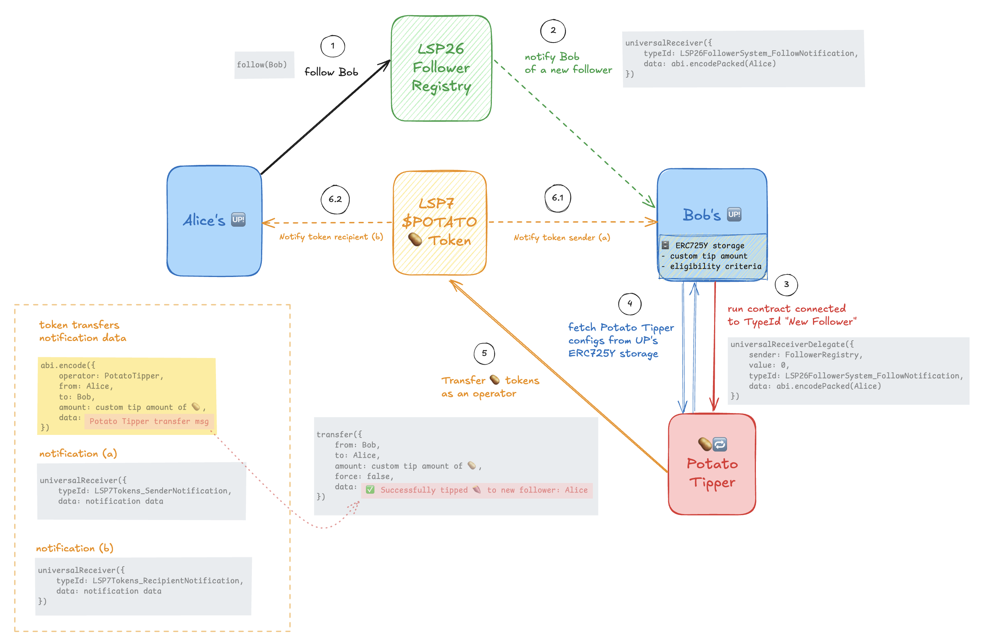

# 🥔🔁 POTATO Tipper **contracts** - [](https://github.com/CJ42/potato-tipper-contract/actions/workflows/test.yml) [](./README.md#code-coverage)

Smart contracts of the POTATO Tipper, a contract that enables you to tip on follow, acting as an incentive mechanism to gain new followers.

| Network       | Contract address                                                                                                                                                 |
| :------------ | :--------------------------------------------------------------------------------------------------------------------------------------------------------------- |
| LUKSO Mainnet | [`0x5eed04004c2D46C12Fe30C639A90AD5d6F5D573d`](https://explorer.lukso.network/address/0x5eed04004c2D46C12Fe30C639A90AD5d6F5D573d?tab=contract)                   |
| LUKSO Testnet | [`0xB844b12313A2D702203109E9487C24aE807e1d66`](https://explorer.execution.testnet.lukso.network/address/0xB844b12313A2D702203109E9487C24aE807e1d66?tab=contract) |

> **Note:** the `PotatoTipper` contract was deployed on LUKSO Mainnet using the [`LSP16UniversalFactory`](https://explorer.execution.mainnet.lukso.network/address/0x1600016e23e25D20CA8759338BfB8A8d11563C4e?tab=contract).

```
⠀⠀⠀⠀⠀⠀⠀⠀⠀⠀⠀⠀⠀⠀⠀⠀⠀⠀⠀⠀⠀⠀⠀⠀⠀⠀⢀⣀⡤⣔⢲⡒⢦⡙⡴⣒⣖⡠⣄⣀⠀⠀⠀⠀⠀⠀⠀⠀⠀⠀⠀⠀
⠀⠀⠀⠀⠀⠀⠀⠀⠀⠀⠀⠀⠀⠀⠀⠀⠀⠀⠀⠀⠀⠀⠀⣠⡴⡞⡹⢆⣝⣤⣣⡙⢦⣙⡴⡡⢦⡙⣱⠺⣭⣖⠤⡀⠀⠀⠀⠀⠀⠀⠀⠀
⠀⠀⠀⠀⠀⠀⠀⠀⠀⠀⠀⠀⠀⠀⠀⠀⠀⠀⠀⠀⢀⣴⠻⣡⢳⠵⠛⠉⠀⠀⠀⡀⢀⠀⡈⠙⢢⡝⡤⢓⠦⡜⠻⣜⡢⣄⠀⠀⠀⠀⠀⠀
⠀⠀⠀⠀⠀⠀⠀⠀⠀⠀⠀⠀⠀⠀⠀⠀⠀⠀⢀⡴⣛⠬⣣⠋⠁⢀⠠⠐⠈⡀⢁⠀⠂⠠⠐⠀⠄⡿⣐⡟⠉⠉⠳⣌⠳⣜⢢⡀⠀⠀⠀⠀
⠀⠀⠀⠀⠀⠀⠀⠀⠀⠀⠀⠀⠀⠀⠀⠀⠀⢠⡞⡸⣤⠟⠀⠀⠌⢀⠀⠂⠐⠀⠄⠈⠄⢁⣄⡬⢞⡱⣡⢛⣤⣐⣀⣼⠳⡌⢧⡱⡄⠀⠀⠀
⠀⠀⠀⠀⠀⠀⠀⠀⠀⠀⠀⠀⠀⠀⠀⠀⢠⡳⢍⡶⠁⠀⠄⠡⢀⣢⠬⡴⢓⡞⢲⠫⡝⢭⠢⡝⢢⡓⠴⣃⢆⡣⡍⢦⠓⡼⢡⠳⣸⡄⠀⠀
⠀⠀⠀⠀⠀⠀⠀⠀⠀⠀⠀⠀⠀⠀⠀⢀⠷⣩⠞⠀⠠⢁⡴⡺⢍⡲⣑⠎⡵⡨⢇⢳⠸⣡⠓⣍⢷⣮⢓⡜⣢⢵⡪⣥⠛⣔⡋⣷⡇⣷⠀⠀
⠀⠀⠀⠀⠀⠀⠀⠀⠀⠀⠀⠀⠀⠀⢀⢾⠣⡏⡀⠄⣡⡏⢖⡩⢖⡱⢜⢪⠱⣱⢊⠧⣙⡔⢫⡔⢫⡱⢎⠴⣃⠾⣽⣶⣋⢦⡹⢿⡛⣧⡇⠀
⠀⠀⠀⠀⠀⠀⠀⠀⠀⠀⠀⠀⠀⢀⢮⠣⣝⠳⡴⡚⢧⣘⢣⠜⢦⡙⡬⢎⠵⣂⢏⠲⣅⠺⣡⢎⢣⡜⣊⠶⡑⣎⢹⢺⣻⣮⡝⢦⡙⣷⣻⠀
⠀⠀⠀⠀⠀⠀⠀⠀⠀⠀⠀⢀⡰⢏⠎⣕⢪⣱⢣⡙⢆⠮⡜⢪⡱⢜⢢⣝⢢⡍⢎⡕⡪⢕⡲⢌⡣⢜⢢⢇⡹⢤⢣⠓⣎⣛⠿⢦⢹⣷⡹⡄
⠀⠀⠀⠀⠀⠀⠀⠀⠀⣀⡴⢫⡙⣬⠚⣌⠦⡹⢟⣻⡿⢶⣍⢣⡜⢪⡱⢏⡣⡜⢎⡴⡙⢦⠱⢎⡱⡩⢖⢪⡑⣎⠲⣍⠲⡌⢞⢢⣻⢞⡵⡇
⠀⠀⠀⠀⠀⠀⠀⣠⡾⢣⢍⡣⡜⠴⡙⢆⡳⢡⠏⡴⢩⣋⠜⣆⡚⢥⢚⡴⡑⢮⡑⢦⡙⢆⠯⣘⠲⣅⠫⢆⠳⣌⠳⣸⣷⣏⢎⡱⣯⡻⣜⡇
⠀⠀⠀⠀⠀⣠⣾⢟⡴⣋⠦⡱⢎⢣⠝⡸⡔⢫⢜⡸⢅⡎⠞⣤⠹⣘⠦⣒⠭⡒⣍⠦⣙⠎⣜⣡⠳⣌⠳⣉⠳⣌⠳⣩⢛⠻⡌⣾⡳⣝⢧⡇
⠀⠀⠀⠀⡴⢟⡹⣻⠿⡎⢖⡱⡩⢎⣚⢱⣮⠇⣎⠖⣩⠜⣱⢊⠵⡡⢞⡰⢣⡙⣤⢋⢦⡙⢆⡖⡱⣊⠵⣉⠶⣡⠓⡥⢎⢳⢸⣷⢫⡽⣺⠅
⠀⠀⢀⢮⡙⣆⢣⠵⡩⢜⠣⣜⣡⠳⣌⠣⣍⡚⡤⢛⡤⢛⢤⡋⡼⡑⣎⠱⢣⡱⢆⢭⠢⡝⠲⢬⡱⢜⡸⢌⠶⣡⢋⢖⡩⢎⡿⣎⢷⡹⣽⠀
⠀⠀⣼⢍⠖⣱⢊⡖⡍⣎⠳⡰⢆⠳⣌⢓⠦⣱⠩⢖⡡⢏⠦⣱⢡⠳⡌⡭⢣⢜⡊⡖⠭⡜⣙⠦⡱⢎⡜⣊⠶⡡⠞⣌⠖⣿⣝⣮⢳⢯⡍⠀
⠀⢸⣻⢜⢪⡑⡎⡴⢓⡌⢇⡓⢎⠳⣌⡚⡜⠴⣙⢬⡚⢬⠲⣅⢎⠳⢬⣑⠣⣎⠜⡜⡥⡙⢆⣧⡓⡼⣐⢣⠎⡵⢩⢆⣿⡻⣼⣎⣟⣞⠃⠀
⠀⣟⣿⡘⣆⢣⡕⢎⡱⢪⡑⢮⠩⡖⣡⠞⣌⠳⡜⣶⣽⣦⣓⢬⢊⡝⢢⠎⡵⡘⢎⡱⡜⣩⢎⢻⠱⡒⡍⢦⢋⡴⢋⣼⣗⣻⣿⣿⡞⡼⠀⠀
⢸⣽⢾⡱⡌⠶⡘⢎⡱⢣⡙⢆⡏⠴⣃⠞⣌⠳⣘⡌⢳⠽⣻⢾⣮⢜⡡⢏⡴⡙⣬⠱⡜⡔⡪⢥⢋⡕⢮⡑⠮⣔⡿⣳⢎⡷⣹⢶⣹⠃⠀⠀
⢸⣞⢧⣷⢉⡞⡩⢮⣵⡣⢎⢣⡜⠳⡌⠞⣌⢣⠕⣊⢇⠮⣑⢫⡙⢦⡙⢆⡖⡍⣆⠳⡜⡸⣑⢎⡱⢊⢦⡙⣼⢞⡳⣝⢾⡱⣏⡞⡏⠀⠀⠀
⠸⣾⣏⠾⣧⣘⠱⢫⡙⣥⢋⢖⣘⢣⠭⣙⢤⡋⡼⢡⢎⠳⣌⢣⡜⢦⡙⡲⠸⡔⢣⡓⣜⣱⣬⠒⡭⣩⢆⣽⢳⢯⡝⣮⢳⡝⣮⡝⠀⠀⠀⠀
⠀⣷⢫⡟⡽⣆⢏⠥⣓⢤⢋⡖⡸⡌⠶⣉⢦⠱⣱⡉⢮⢱⡘⡆⠞⣤⠓⣍⢣⠝⣢⠕⡺⢽⠻⣍⢲⣱⠾⣭⣛⢮⣝⢮⡳⡽⡞⠀⠀⠀⠀⠀
⠀⢸⣻⣜⡳⣝⡻⣔⢣⠎⣖⠸⣱⢘⡣⢕⡪⠕⢦⡙⢆⡇⢞⡸⣉⢦⠹⡌⢎⢎⡱⢎⡱⢎⡱⡼⡾⣭⣛⢶⡹⣞⡼⣣⢟⡝⠀⠀⠀⠀⠀⠀
⠀⠀⢷⣫⠷⣭⢳⣏⢷⢾⣈⡓⠦⣍⡒⠧⡜⣙⠦⡙⢦⣿⡦⢱⢊⢦⢋⡼⣉⠦⡓⣬⣱⢾⡹⣏⢷⣣⢟⣮⢳⡝⣾⣱⠏⠀⠀⠀⠀⠀⠀⠀
⠀⠀⠈⢯⣟⡼⣳⢎⡟⣮⢯⡽⣳⢦⣙⡜⡜⡢⢝⡘⢦⡙⡴⢋⡜⣢⢍⢲⣡⠾⣵⢫⡞⣧⢻⡼⣿⣿⡾⣜⢧⡻⣶⠋⠀⠀⠀⠀⠀⠀⠀⠀
⠀⠀⠀⠈⢿⢾⡵⣛⠾⣵⣿⣾⣭⢯⡝⣾⣹⢳⡟⣞⢦⡳⣜⡳⣞⢶⣫⢟⡼⣻⣼⣳⢻⣼⣣⠿⣽⣛⢷⡹⣮⠟⠁⠀⠀⠀⠀⠀⠀⠀⠀⠀
⠀⠀⠀⠀⠀⠻⣽⣯⣟⣿⣿⡿⣏⢾⡹⢶⣭⢳⡝⣮⢳⡝⣧⢻⡜⣧⣛⢮⣳⢳⢾⣻⢟⣾⣽⣛⡶⣹⢮⠿⠋⠀⠀⠀⠀⠀⠀⠀⠀⠀⠀⠀
⠀⠀⠀⠀⠀⠀⠈⠻⣿⣷⣹⢞⡽⢮⣝⡳⣎⢷⡹⣎⢷⡹⣎⢷⣿⣧⣟⢮⣳⣛⡾⣝⡻⣞⣽⢿⡽⠟⠁⠀⠀⠀⠀⠀⠀⠀⠀⠀⠀⠀⠀⠀
⠀⠀⠀⠀⠀⠀⠀⠀⠈⠳⢻⡿⣼⡳⣎⢷⡹⣎⢷⡹⣎⢷⡹⣾⣿⣿⢿⣫⣿⣿⡜⣧⢟⡾⠜⠋⠀⠀⠀⠀⠀⠀⠀⠀⠀⠀⠀⠀⠀⠀⠀⠀
⠀⠀⠀⠀⠀⠀⠀⠀⠀⠀⠀⠉⠓⠿⣹⡞⡵⢯⡞⣵⣫⣞⣵⣳⡞⣼⢣⡷⣻⡼⠽⠚⠉⠀⠀⠀⠀⠀⠀⠀⠀⠀⠀⠀⠀⠀⠀⠀⠀⠀⠀⠀
⠀⠀⠀⠀⠀⠀⠀⠀⠀⠀⠀⠀⠀⠀⠀⠈⠉⠑⠛⠒⠛⠚⠓⠓⠛⠊⠉⠉⠀⠁⠀⠀⠀⠀⠀⠀
```

> **⚠️ Disclaimer:** the `PotatoTipper.sol` contract is experimental. Use it responsibly and at your own risk.
>
> Although it has been thoroughly tested with Foundry and some auditing tools, it has not been formally audited by an external third party auditor.
>
> See the [**Known Limitations**](#known-limitations) and [**Security**](#security) sections for more details and the known trade-offs.

- [🥔🔁 POTATO Tipper **contracts** - ](#-potato-tipper-contracts----)
  - [Overview](#overview)
  - [Known Limitations](#known-limitations)
  - [Technical Details](#technical-details)
    - [Smart contract specifics](#smart-contract-specifics)
    - [Interaction Flow](#interaction-flow)
  - [Learning](#learning)
  - [Security](#security)
  - [Code Coverage](#code-coverage)
  - [Gas report](#gas-report)
- [Development](#development)
  - [Pre-requisites](#pre-requisites)
  - [Developing with Foundry](#developing-with-foundry)

## Overview

- 🫡 **Permission-less**: smart contract not controlled or governed by anyone
- 🔄 **Automatic tipping mechanism:** built fully on-chain for 🆙 when receiving new followers
- 🚫 **Censorship resistant:** tipping happens automatically in the background on-chain, regardless of the dApp you are using to follow the user (not tied to a specific dApp, no _"dApp lock-in"_)
- ⚙️ **Configurable settings:**

  - customizable tip amount (🥔, or 🥔🥔, or 🥔🥔🥔, or more...)
  - allocated tipping budget (cannot use user's full 🥔 balance unless configured as such)
  - eligibility criteria for a new follower to get a tip (_e.g: at least have 3 followers, or X amount of $POTATO tokens_)

- 🌐 **Portable settings:** PotatoTipper’s settings live as metadata inside each user’s 🆙, making them:

  - easily readable (per user, instead of having to interact with the `PotatoTipper` contract)
  - easily portable (_e.g: if a future Potato Tipper v2 is live, the settings are portable and don’t need to be reset again_)

- ✅🆙 **Only for Universal Profile:** only 🆙 can receive tips (❌🔑 not EOAs)
  - new followers can only get one tip per user. They cannot unfollow and re-follow to try to get many tips.
  - existing followers are not eligible to receive tips from 🆙 users they already follow


## Testing on Testnet

The `PotatoTipper` contract is also deployed on **LUKSO Testnet** and can be used for testing.

- **Potato Token (LSP7) on Testnet:** `0xE8280e7f0d54daE39725dC5f500F567Af2854A13`

The Testnet Potato Token contract has a **public `mint` function** that anyone can call directly from the **Blockscout explorer** (free faucet style). This makes it easy to get free 🥔 tokens for testing without having to ask other developers/maintainers.


## Known Limitations

- The Potato Tipper only works for new followers (therefore the notion of an _"incentive system"_). Existing followers cannot get tipped (as mentioned above). If a user (Alice) connects the Potato Tipper to its UP, and Bob was following Alice before she used the Potato Tipper, Bob will never be able to get a tip from the Potato Tipper contract. Even by trying to unfollow and re-follow Alice.
- If Alice's UP follows Bob's UP and get tipped some 🥔, this does not guarantee that Alice will keep following Bob's afterwards. If Alice unfollows Bob, Bob will not get the 🥔 he tipped back. The Potato Tipper is not opinionated towards this behaviour as UPs might unfollow each other afterwards for legitimate reasons. The Potato Tipper cannot differentiate that.

## Learning

The [`LEARN.md`](./LEARN.md) file offer resources for those wanting to learn more about the Potato Tipper and its design patterns that use the [LSP1 Universal Receiver Delegate](https://docs.lukso.tech/standards/accounts/lsp1-universal-receiver-delegate/) standard.

### Smart contract specifics

- 📢 Built as an LSP1 Universal Receiver Delegate contract.
- 🔌 Work automatically once it is _"plugged-in_ to a Universal Profile to reacts on follow / unfollow notifications from LSP26 Follower System. This can be done by setting the Potato Tipper contract address as a value under the following data keys in a UP:

  - `LSP1UniversalReceiverDelegate:LSP26FollowerSystem_FollowNotification` -> `0x0cfc51aec37c55a4d0b1000071e02f9f05bcd5816ec4f3134aa2e5a916669537`
  - `LSP1UniversalReceiverDelegate:LSP26FollowerSystem_UnfollowNotification` -> `0x0cfc51aec37c55a4d0b100009d3c0b4012b69658977b099bdaa51eff0f0460f4`

- 🗄️ Tipping configurations stored as metadata under the data key `PotatoTipper:Settings` of the user's Universal Profile (ERC725Y contract storage)

  - `0xd1d57abed02d4c2d7ce00000e8211998bb257be214c7b0997830cd295066cc6a` -> see [`LEARN.md > Data Keys`](./LEARN.md#data-keys) section for details on how to encode the tip settings

- 🤝🏻 Act as an operator via [`authorizeOperator(...)`](https://docs.lukso.tech/contracts/contracts/LSP7DigitalAsset/#authorizeoperator) to transfer tokens on behalf of the user's UP.
  - Give it the allocated tipping budget as authorized amount / allowance.
  - No 🥔 tokens need to be transferred to the `PotatoTipper` contract (it transfers them on behalf of the user's 🆙).

### Interaction Flow



## Security

See the [`audits/`](./audits/) folder for security analysis ran on the contracts and the reports generated with AI auditing tools from Ackee and Nethermind, as well as any additional security notes.

## Code Coverage

```
╭----------------------------+----------------+-----------------+----------------+-----------------╮
| File                       | % Lines        | % Statements    | % Branches     | % Funcs         |
+==================================================================================================+
| src/PotatoTipper.sol       | 98.48% (65/66) | 97.56% (80/82)  | 95.24% (20/21) | 100.00% (10/10) |
|----------------------------+----------------+-----------------+----------------+-----------------|
| src/PotatoTipperConfig.sol | 89.47% (17/19) | 94.44% (17/18)  | 100.00% (0/0)  | 75.00% (3/4)    |
|----------------------------+----------------+-----------------+----------------+-----------------|
| Total                      | 96.47% (82/85) | 97.00% (97/100) | 95.24% (20/21) | 92.86% (13/14)  |
╰----------------------------+----------------+-----------------+----------------+-----------------╯
```

## Gas report

```log

Ran 40 tests for tests/PotatoTipper.t.sol:PotatoTipperTest
[PASS] test_EOAsCannotReceiveTipsOnFollow() (gas: 384346)
[PASS] test_FollowerDoesNotAlreadyFollowUser() (gas: 13099)
[PASS] test_FollowerFollowUser() (gas: 236248)
[PASS] test_IsLSP1Delegate() (gas: 8516)
[PASS] test_OnlyCallsFromFollowerRegistry(address) (runs: 1000, μ: 259704, ~: 259782)
[PASS] test_PotatoTipperIsRegisteredForNotificationTypeNewFollower() (gas: 17251)
[PASS] test_PotatoTipperIsRegisteredForNotificationTypeUnfollow() (gas: 17218)
[PASS] test_aliceUPCannotCallBobUPUniversalReceiverFunctionToGetTipped() (gas: 278066)
[PASS] test_canFollowBatchTwoUsersAndGetTipsFromBoth() (gas: 1086722)
[PASS] test_cannotTipTwiceTheSameNewFollowerIfFollowedUnfollowAndRefollow() (gas: 873355)
[PASS] test_configDataKeysListReturnsCorrectBytes32DataKeysList() (gas: 10752)
[PASS] test_configDataKeysReturnsCorrectBytes32DataKeys() (gas: 9552)
[PASS] test_customTipAmount() (gas: 645714)
[PASS] test_customTipAmountGreaterThanUserBalanceButLessThanTippingBudgetDontTriggerTip(uint256,uint256) (runs: 1000, μ: 511205, ~: 511073)
[PASS] test_customTipAmountLessThanUserBalanceButGreaterThanTippingBudgetDontTriggerTip(uint256,uint256) (runs: 1000, μ: 516475, ~: 516512)
[PASS] test_customTipAmountSetToZeroDontTriggerTip() (gas: 481596)
[PASS] test_customTipSettingsIncorrectlySetDontTriggerTip(bytes) (runs: 1000, μ: 503970, ~: 492085)
[PASS] test_doesNotTipIfTipSettingsDataKeyNotSet() (gas: 466681)
[PASS] test_encodeConfigDataKeysValuesReturnsCorrectBytes32AndBytesData(uint256,uint256,uint256) (runs: 1000, μ: 19665, ~: 19665)
[PASS] test_existingFollowerCannotTriggerDirectlyToGetTipped() (gas: 282478)
[PASS] test_existingFollowerUnfollowsAndRefollowDoesNotTriggerTip() (gas: 642493)
[PASS] test_fallbackToDisplayGenericErrorMessageInUniversalReceiverEventIfTippingFails() (gas: 1511566)
[PASS] test_followerCanReceiveTipsFromTwoDifferentUsersWhoConnectedPotatoTipper() (gas: 1126496)
[PASS] test_lsp1DelegateOnFollowDataKeyConstantIsCorrectlyEncoded() (gas: 3441)
[PASS] test_lsp1DelegateOnUnfollowDataKeyConstantIsCorrectlyEncoded() (gas: 3461)
[PASS] test_minimumFollowerRequiredExactMatchTriggerTip() (gas: 674374)
[PASS] test_minimumFollowerRequiredNotMetDontTriggerTip(uint256) (runs: 1000, μ: 569573, ~: 569529)
[PASS] test_minimumPotatoBalanceRequiredExactMatchTriggerTip() (gas: 669445)
[PASS] test_minimumPotatoBalanceRequiredNotMetDontTriggerTip(uint256) (runs: 1000, μ: 573745, ~: 573485)
[PASS] test_newFollowerFailsToGetTipBecauseNotEligibleButCanUnfollowAndRefollowToGetTip() (gas: 1077780)
[PASS] test_onlyRunWithFollowOrUnfollowTypeId(bytes32) (runs: 1000, μ: 56665, ~: 56805)
[PASS] test_onlyUniversalProfilesCanReceiveTips() (gas: 1091836)
[PASS] test_shouldNotTipButStillFollowIfPotatoTipperConnectedButNotAuthorizedAsOperator() (gas: 319732)
[PASS] test_tippingFailsAfterTippingBudgetGoesBelowCustomAmount(uint256) (runs: 1001, μ: 953411, ~: 953432)
[PASS] test_tippingFailsAfterTippingBudgetGoesToZero() (gas: 922767)
[PASS] test_tippingOnFollowAfterAuthorizingPotatoTipperAsOperator() (gas: 553635)
[PASS] test_userCallsDirectlyPotatoTipperWithTypeIdFollowAndExistingFollower() (gas: 480250)
[PASS] test_userCallsDirectlyPotatoTipperWithTypeIdUnfollowAndAddressThatDoesNotActuallyFollow() (gas: 305518)
[PASS] test_userCallsDirectlyPotatoTipperWithTypeIdUnfollowAndExistingFollower() (gas: 278671)
[PASS] test_userWhoRegisteredPotatoTipperCannotCallContractDirectlyToTipUsersThatDontActuallyFollow() (gas: 175649)
Suite result: ok. 40 passed; 0 failed; 0 skipped; finished in 65.13s (97.56s CPU time)

╭--------------------------------------------+-----------------+-------+--------+--------+---------╮
| src/PotatoTipper.sol:PotatoTipper Contract |                 |       |        |        |         |
+==================================================================================================+
| Deployment Cost                            | Deployment Size |       |        |        |         |
|--------------------------------------------+-----------------+-------+--------+--------+---------|
| 1885376                                    | 8544            |       |        |        |         |
|--------------------------------------------+-----------------+-------+--------+--------+---------|
|                                            |                 |       |        |        |         |
|--------------------------------------------+-----------------+-------+--------+--------+---------|
| Function Name                              | Min             | Avg   | Median | Max    | # Calls |
|--------------------------------------------+-----------------+-------+--------+--------+---------|
| configDataKeys                             | 458             | 458   | 458    | 458    | 1       |
|--------------------------------------------+-----------------+-------+--------+--------+---------|
| configDataKeysList                         | 983             | 983   | 983    | 983    | 1       |
|--------------------------------------------+-----------------+-------+--------+--------+---------|
| encodeConfigDataKeysValues                 | 2764            | 2764  | 2764   | 2764   | 296     |
|--------------------------------------------+-----------------+-------+--------+--------+---------|
| hasExistingFollowerUnfollowedPostInstall   | 2732            | 2732  | 2732   | 2732   | 528     |
|--------------------------------------------+-----------------+-------+--------+--------+---------|
| hasFollowedPostInstall                     | 2754            | 2754  | 2754   | 2754   | 795     |
|--------------------------------------------+-----------------+-------+--------+--------+---------|
| hasReceivedTip                             | 2729            | 2729  | 2729   | 2729   | 4154    |
|--------------------------------------------+-----------------+-------+--------+--------+---------|
| supportsInterface                          | 350             | 357   | 350    | 367    | 3895    |
|--------------------------------------------+-----------------+-------+--------+--------+---------|
| universalReceiverDelegate                  | 42272           | 94703 | 55714  | 225111 | 4       |
╰--------------------------------------------+-----------------+-------+--------+--------+---------╯
```

# Development

## Pre-requisites

1. Install the [**`bun`** package manager](https://bun.sh/package-manager).
2. [Install foundry](https://getfoundry.sh/).
3. Install the dependencies

```bash
forge install
bun install

# Compile the contracts (ABI + generated bytecode in `build/` folder)
bun run build

# Bun commands for tests below uses under the hood the flag `--fork-url https://rpc.mainnet.lukso.network`

# Run fork tests against LUKSO mainnet
bun run test

# Run fork tests + display gas report
bun run test:gas

# Run fork tests + show code coverage
bun run test:coverage

# Format Solidity code
# Formatting rules can be adjusted under the `[fmt]` section in the `foundry.toml` file
bun run format
```

## Developing with Foundry

This template repository is based on Foundry, **a blazing fast, portable and modular toolkit for EVM application development written in Rust.** It includes:

- **Forge**: Ethereum testing framework (like Truffle, Hardhat and DappTools).
- **Cast**: Swiss army knife for interacting with EVM smart contracts, sending transactions and getting chain data.
- **Anvil**: Local Ethereum node, akin to Ganache, Hardhat Network.
- **Chisel**: Fast, utilitarian, and verbose solidity REPL.

You can find more documentation at: https://book.getfoundry.sh/
